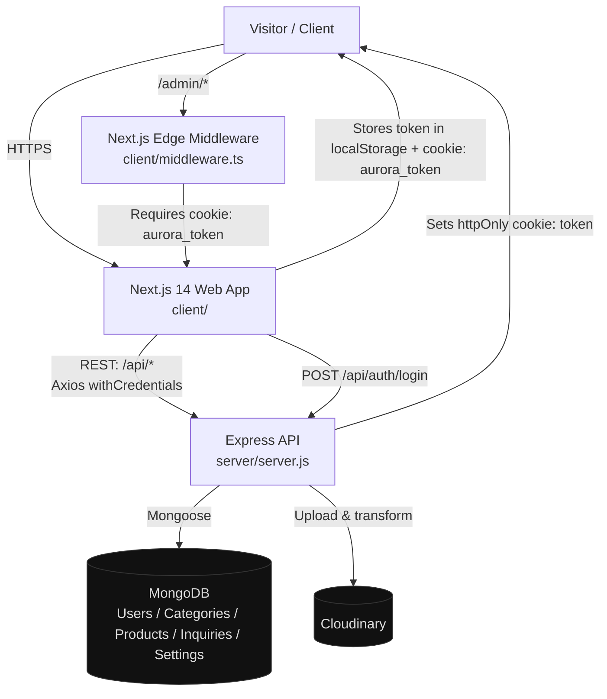
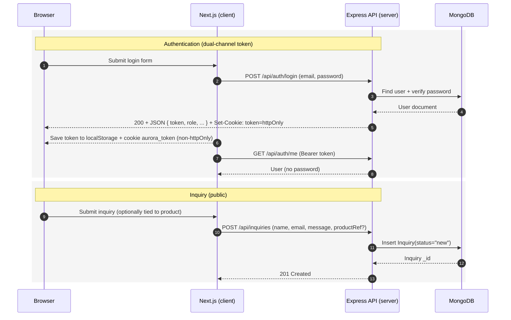
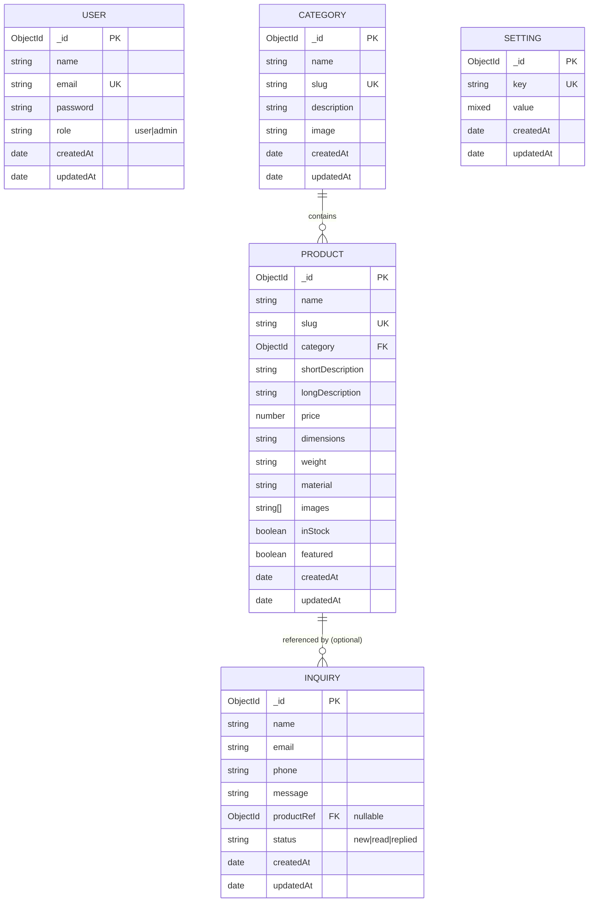

# Aurora Living Designs — Full Stack Application

**Luxury Concrete Crafts | London, Ontario (est. 2018)**

A premium full-stack catalog and inquiry platform for handcrafted architectural and decorative concrete pieces. Built with Next.js 14 (App Router), Express.js, MongoDB (Mongoose), and Cloudinary.

---

## Project Structure

```
aurora-living-designs/
├── client/                   ← Next.js 14 (App Router) frontend
│   ├── app/
│   │   ├── page.tsx          ← Homepage (all new sections)
│   │   ├── products/         ← Product listing + detail
│   │   ├── about/
│   │   ├── contact/
│   │   ├── login/
│   │   ├── register/
│   │   └── admin/            ← Protected admin panel
│   │       ├── page.tsx      ← Overview dashboard
│   │       ├── products/     ← CRUD with edit/[id]
│   │       ├── categories/
│   │       ├── inquiries/
│   │       └── settings/
│   ├── components/
│   │   ├── sections/         ← Hero, StatsBar, ProcessSection,
│   │   │                        Testimonials, FAQSection,
│   │   │                        GalleryStrip, CTABanner
│   │   ├── layout/           ← Navbar, Footer, AdminSidebar
│   │   ├── ui/               ← ProductCard, InquiryModal
│   │   └── providers/        ← AuthProvider
│   ├── lib/
│   │   ├── api.ts            ← Axios instance + auth interceptor
│   │   └── auth.ts           ← Zustand auth store
│   └── middleware.ts         ← Next.js edge middleware (admin guard)
│
└── server/                   ← Express.js REST API
    ├── controllers/          ← auth, product, category, inquiry
    ├── middleware/           ← protect.js, isAdmin.js, cloudinary.js
    ├── models/               ← User, Product, Category, Inquiry, Setting
    ├── routes/               ← auth, products, categories, inquiries, admin
    ├── seed/
    │   └── seed.js           ← Database seeder
    └── server.js
```

---

## System Design Architecture

The system is a two-tier web application: a Next.js frontend for browsing and admin UX, backed by an Express REST API that owns authentication, persistence, and media uploads.





---

## Quick Start

### 1. Backend

```bash
cd server
npm install
```

Create `/server/.env` (copy from `.env.example`):

```env
PORT=5000
MONGO_URI=mongodb+srv://<user>:<pass>@cluster.mongodb.net/aurora
JWT_SECRET=pick_a_long_random_string_min_32_chars
JWT_EXPIRE=7d
CLOUDINARY_CLOUD_NAME=your_cloud_name
CLOUDINARY_API_KEY=your_api_key
CLOUDINARY_API_SECRET=your_api_secret
CLIENT_URL=http://localhost:3000
NODE_ENV=development
```

**Run the seed script** (creates admin, test user, categories, products, sample inquiries):

```bash
npm run seed

# Or reset everything and re-seed from scratch:
npm run seed:fresh
```

**Start the server:**

```bash
npm run dev     # Development with nodemon (auto-reload)
npm start       # Production
```

Server: `http://localhost:5000`

---

### 2. Frontend

```bash
cd client
npm install
```

Create `/client/.env.local`:

```env
NEXT_PUBLIC_API_URL=http://localhost:5000/api
```

**Start the frontend:**

```bash
npm run dev     # Development
npm run build   # Production build
npm start       # Serve production build
```

Frontend: `http://localhost:3000`

---

## Default Credentials (after seeding)

| Role | Email | Password | Redirect |
|------|-------|----------|----------|
| Admin | `admin@concretecrafts.com` | `Admin@123` | `/admin` |
| User | `user@test.com` | `User@1234` | `/` |

> **Admin panel:** `http://localhost:3000/admin`
> Only accounts with `role: "admin"` in MongoDB can access it.

---

## API Reference

### Auth — `/api/auth`

| Method | Endpoint | Auth | Description |
|--------|----------|------|-------------|
| POST | `/register` | Public | Create account (role: user always) |
| POST | `/login` | Public | Returns JWT + sets httpOnly cookie |
| POST | `/logout` | Public | Clears auth cookie |
| GET | `/me` | Protected | Returns current user (no password) |

JWT payload: `{ id, role }` — 7-day expiry.
Token sent as `Authorization: Bearer <token>` header AND stored in an httpOnly cookie.

---

### Products — `/api/products`

| Method | Endpoint | Auth | Description |
|--------|----------|------|-------------|
| GET | `/` | Public | Paginated list with filters |
| GET | `/:slug` | Public | Single product by slug **or** `_id` |
| POST | `/` | Admin | Create product (multipart/form-data) |
| PUT | `/:id` | Admin | Update product (merges existingImages) |
| DELETE | `/:id` | Admin | Delete product |

**Query params for GET `/`:**

| Param | Example | Description |
|-------|---------|-------------|
| `category` | `garden-fountains` | Filter by category slug |
| `sort` | `newest` / `price-asc` / `price-desc` | Sort order |
| `featured` | `true` | Featured products only |
| `page` | `1` | Page number |
| `limit` | `12` | Items per page |

---

### Categories — `/api/categories`

| Method | Endpoint | Auth | Description |
|--------|----------|------|-------------|
| GET | `/` | Public | All categories |
| POST | `/` | Admin | Create category |
| PUT | `/:id` | Admin | Update category |
| DELETE | `/:id` | Admin | Delete category |

---

### Inquiries — `/api/inquiries`

| Method | Endpoint | Auth | Description |
|--------|----------|------|-------------|
| POST | `/` | Public | Submit inquiry (contact form) |
| GET | `/` | Admin | All inquiries (filter by `?status=new`) |
| PUT | `/:id` | Admin | Update status (new / read / replied) |

---

### Admin Stats — `/api/admin`

| Method | Endpoint | Auth | Description |
|--------|----------|------|-------------|
| GET | `/stats` | Admin | `{ products, categories, inquiries, newInquiries, users }` |

---

## Homepage Sections (in order)

1. **Hero** — Full-screen with product images grid
2. **Category Strip** — 4 category quick-links
3. **Featured Products** — 3 featured products from DB
4. **About Strip** — Workshop story + 3-step process
5. **StatsBar** — Count-up animation: 500+ Projects, 37+ Years, 200+ Designs, 100% Handmade
6. **ProcessSection** — 3-step "How It's Made" with gold connecting line
7. **Testimonials** — 8 reviews in dual-row infinite marquee (pauses on hover)
8. **FAQSection** — 8 accordion FAQ items with AnimatePresence
9. **GalleryStrip** — 3×2 image grid with hover camera overlay
10. **CTABanner** — Full-width with diagonal CSS texture + two gold buttons
11. **Footer**

---

## Admin Panel Pages

| Route | Description |
|-------|-------------|
| `/admin` | Overview: 4 stat cards + 5 recent products table |
| `/admin/products` | Product list: search, category filter, image thumbnails, edit/delete |
| `/admin/products/new` | Create product form: slug auto-gen, char counter, image upload, toggles |
| `/admin/products/edit/[id]` | Edit product: pre-populated form, existing image management |
| `/admin/categories` | Category CRUD with inline edit form |
| `/admin/inquiries` | Inquiry list + slide-over detail panel with mark-read/replied |
| `/admin/settings` | Admin profile + system info placeholder |

---

## Authentication Flow

```
User logs in → POST /api/auth/login
  → JWT returned in JSON body as token
  → Server sets httpOnly cookie: token
  → Client stores token in localStorage (aurora_token)
  → Client also sets a non-httpOnly cookie (aurora_token) for Next.js Edge Middleware
  → AuthProvider reads token on mount → calls /api/auth/me
  → Zustand store hydrated with { user, token, isAdmin }

Admin navigates to /admin/* →
  → Next.js middleware checks cookie (aurora_token) at the edge (fast gate)
  → AdminLayout checks isAdmin (client-side, confirms role)
  → Redirect to /login if either check fails

Logout →
  → localStorage cleared (aurora_token)
  → Client cookie deleted (aurora_token)
  → Server cookie cleared (token)
  → Store reset → redirect to /
```

---

## Database Design (MongoDB)

Collections are modeled with Mongoose. Relationships are represented via `ObjectId` references (e.g., `Product.category → Category._id`).



---

## Cloudinary Setup

1. Create free account at [cloudinary.com](https://cloudinary.com)
2. Dashboard → copy **Cloud Name**, **API Key**, **API Secret**
3. Add to `/server/.env`
4. Images auto-upload to folder `aurora-living-designs/` at 1200×1200px max

> If Cloudinary is not configured: product creation still works but images won't persist across server restarts.

---

## MongoDB Setup (Atlas)

1. [mongodb.com/atlas](https://www.mongodb.com/atlas) → Create free cluster
2. Database Access → Create user with read/write
3. Network Access → Add `0.0.0.0/0` for development
4. Connect → Copy connection string → paste as `MONGO_URI`

> **Without MONGO_URI:** Server auto-starts with `mongodb-memory-server` (in-memory, data lost on restart) — useful for local dev without Atlas.

---

## Deployment

### Backend — Railway / Render / VPS

```
Build: npm install
Start: npm start
Env:   Set all variables from .env.example in platform dashboard
```

### Frontend — Vercel

```
Framework: Next.js (auto-detected)
Env:       NEXT_PUBLIC_API_URL=https://your-backend-domain.com/api
```

For Vercel serverless: the `server/api/index.js` exports the Express app as a serverless function.

---

## Brand Tokens

| Token | Value | Usage |
|-------|-------|-------|
| `gold` | `#f0c040` | Headlines, CTAs, active states, borders |
| `gold-dark` | `#b8942a` | Hover borders, muted accents |
| `aurora-black` | `#0d0d0d` | Page background |
| `aurora-card` | `#111111` | Card surfaces, admin sidebar |
| `aurora-card2` | `#161616` | Nested cards, spec tiles |
| `aurora-text` | `#f5f5f0` | Body text |
| `aurora-muted` | `#a89f8c` | Secondary text, labels |

**Fonts:** Playfair Display (headings) + Cormorant Garamond (body)

---

## Seed Script Options

```bash
# Standard seed — upserts (safe to re-run, won't duplicate)
npm run seed

# Fresh seed — drops all data first, then seeds
npm run seed:fresh
```

**What gets seeded:**
- 1 admin user: `admin@concretecrafts.com` / `Admin@123`
- 1 test user: `user@test.com` / `User@1234`
- 4 categories: Garden Fountains, Ceiling Medallions, Sculptures, Custom Pieces
- 9 products (3 featured) across all categories
- 3 sample inquiries (2 new, 1 replied)
